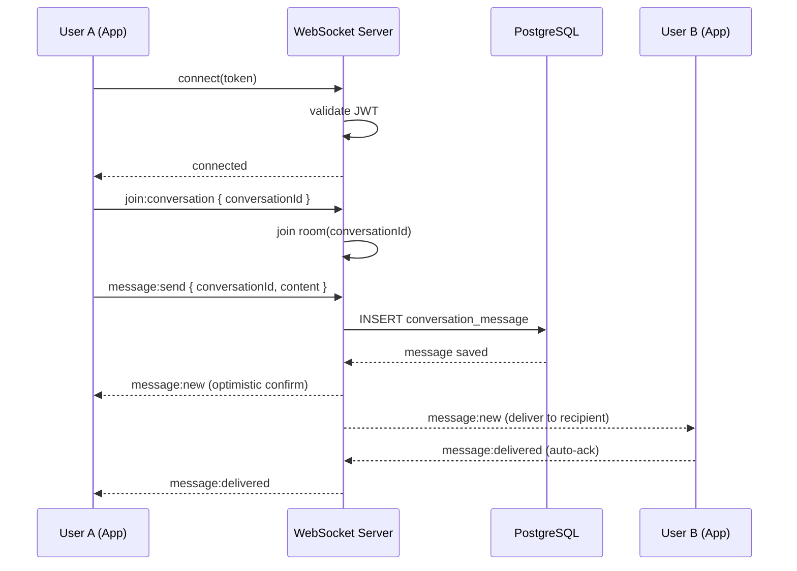
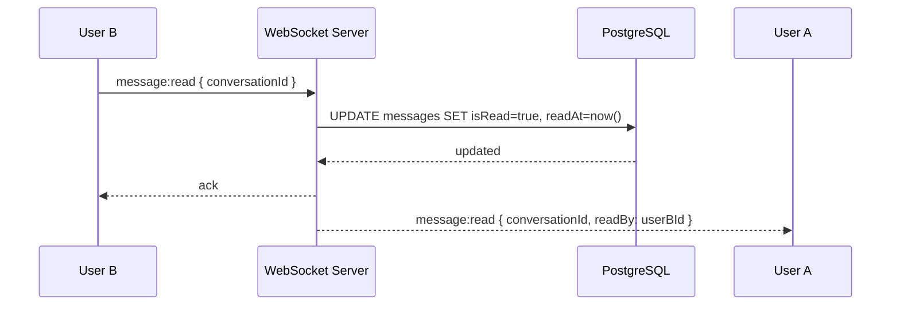
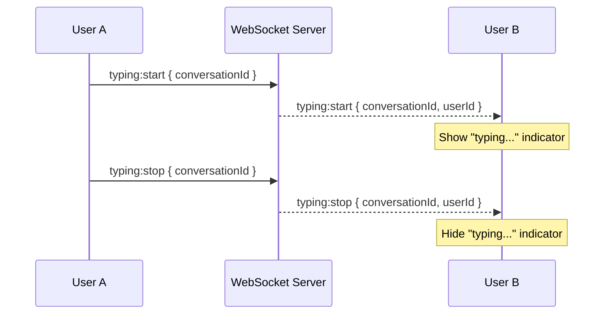
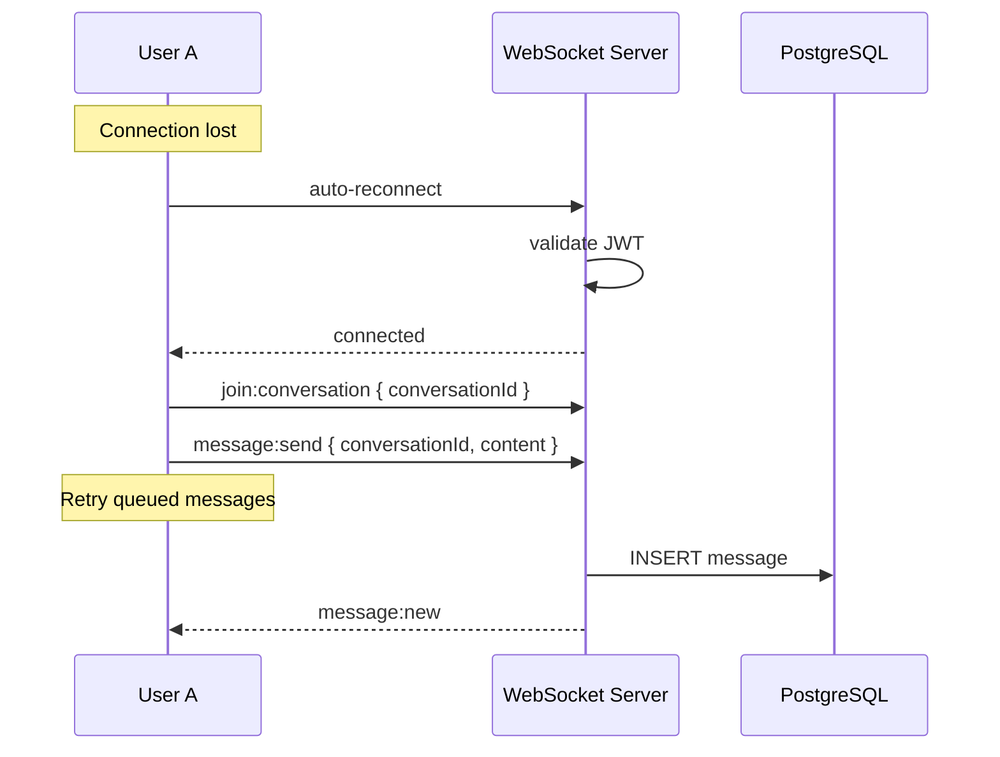
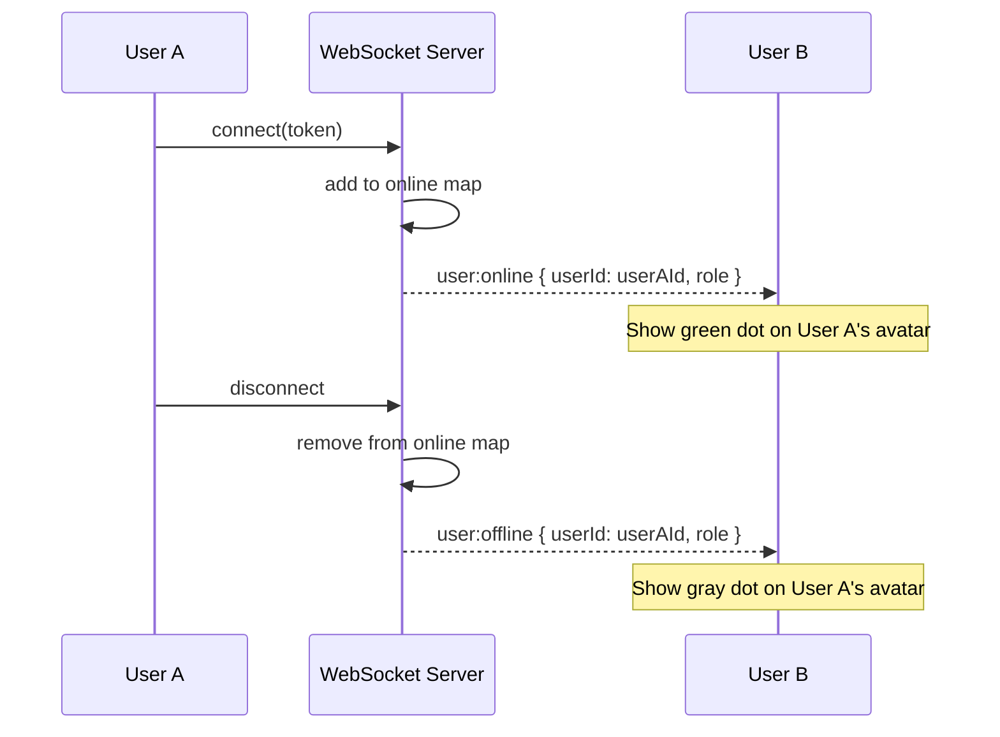

# Real-Time One-to-One Chat — Implementation Plan

---

## Current Project Analysis

### Existing Architecture

**Backend (server/)**
- **Framework:** NestJS v11, modular feature-based architecture
- **Database:** PostgreSQL 16 via Drizzle ORM v0.45, 37 tables, 18 enums
- **Auth:** JWT (jsonwebtoken library), Bearer token, no role-based guards
- **API Prefix:** `/api/v1` (set in main.ts)
- **File Upload:** Local disk via multer (`uploads/` directory)
- **WebSocket:** None
- **Caching/Queue/Redis:** None
- **Push Notifications:** None
- **Error Handling:** GlobalExceptionFilter, NestJS ValidationPipe (whitelist mode)
- **Logging:** NestJS Logger (in exception filter), console.log (in auth service)

**App (app/)**
- **Framework:** Expo SDK 54, React Native 0.81.5, React 19.1.0
- **Navigation:** NativeStackNavigator (root) + BottomTabNavigator (custom FloatingBottomBar)
- **Auth:** React Context (AuthContext), AsyncStorage persistence, role-based (user/astrologer/admin)
- **API:** Axios singleton, 15s timeout, Bearer token interceptor
- **State Management:** React Context only (no Redux/Zustand)
- **UI Library:** react-native-paper MD3 + 12 custom components
- **Theme:** Dark-first, dynamic getters, purple primary + gold accent
- **Chat:** UI skeleton only — no real-time messaging, no WebSocket
- **Push Notifications:** Not implemented
- **File Upload:** Not implemented (no image picker)

### Existing Chat-Related Code

**Database:** `chat_messages` table exists but is tied to `callId` (FK to call_logs). It is designed for call-associated messages only.

**Backend ChatModule:** REST endpoints for CRUD on call-associated messages:
- `GET /chat?callId=xxx` — list messages by call
- `POST /chat` — create message
- `PUT /chat/:id/read` — mark as read

**App ChatScreen:** UI skeleton only — FlatList with empty state, text input bar, send button is a no-op.

---

## Chat Requirements

| Feature | Description |
|---------|-------------|
| One-to-One Chat | Direct messaging between user and astrologer |
| Real-time messaging | Instant delivery via WebSocket (Socket.IO) |
| Online/Offline status | Show green/gray dot on avatar |
| Typing indicator | Show "typing..." when the other person is typing |
| Message delivery | Single tick (sent) → Double tick (delivered) |
| Read receipts | Double blue tick when recipient opens conversation |
| Message history | Load past messages on conversation open |
| Pagination | Cursor-based, 20 messages per page |
| Infinite scrolling | Load more on scroll to top |
| Retry failed messages | Tap to retry if send fails |
| Optimistic UI | Show message immediately, update status async |
| Reconnection handling | Auto-reconnect with Socket.IO, re-join rooms |
| File/Image support | Upload images via existing file upload endpoint |
| Push notifications | Not possible — no push notification infrastructure exists |
| Authentication | JWT token required for WebSocket connection |
| Authorization | Only participants can read/send in a conversation |

### Features NOT possible due to existing architecture

1. **Push notifications** — No `expo-notifications`, no FCM setup, no push token registration. Adding this would require significant new infrastructure (FCM project, expo-notifications package, push token storage, notification sending service). Out of scope.

2. **File/Image upload from chat** — The server has a file upload endpoint, but the app has no image picker library (`expo-image-picker` not installed). Can be added as a follow-up.

---

## Database Changes

### Why new tables are needed

The existing `chat_messages` table has `callId` as a NOT NULL foreign key to `call_logs`. It is designed for messages exchanged during a call session. One-to-one chat is a different concept — conversations exist independently of calls. Modifying `chat_messages` to make `callId` nullable and add a `conversationId` would:
1. Break the existing ChatModule which queries by `callId`
2. Mix two different concerns in one table
3. Require complex migration of existing data

**Solution:** Create two new tables while keeping `chat_messages` unchanged.

### New Table: `conversations`

Represents a one-to-one chat session between two participants.

| Column | Type | Constraints |
|--------|------|-------------|
| id | uuid | PK, defaultRandom |
| participantOneId | uuid | FK -> users.id OR astrologers.id, NOT NULL |
| participantOneRole | user_role | NOT NULL |
| participantTwoId | uuid | FK -> users.id OR astrologers.id, NOT NULL |
| participantTwoRole | user_role | NOT NULL |
| lastMessageAt | timestamp | nullable |
| lastMessagePreview | varchar(200) | nullable |
| createdAt | timestamp | NOT NULL, defaultNow |
| updatedAt | timestamp | NOT NULL, defaultNow |

**Indexes:**
- `(participantOneId, participantTwoId)` — unique composite (prevents duplicate conversations)
- `(participantOneId, lastMessageAt)` — for ordering user's conversation list
- `(participantTwoId, lastMessageAt)` — for ordering other participant's conversation list

### New Table: `conversation_messages`

Individual messages within a conversation.

| Column | Type | Constraints |
|--------|------|-------------|
| id | uuid | PK, defaultRandom |
| conversationId | uuid | FK -> conversations.id, CASCADE, NOT NULL |
| senderId | uuid | NOT NULL |
| senderRole | user_role | NOT NULL |
| type | message_type | NOT NULL, default 'text' (reuse existing enum) |
| content | text | nullable |
| mediaUrl | text | nullable |
| isDelivered | boolean | NOT NULL, default false |
| isRead | boolean | NOT NULL, default false |
| readAt | timestamp | nullable |
| createdAt | timestamp | NOT NULL, defaultNow |

**Indexes:**
- `(conversationId, createdAt DESC)` — for paginated message loading
- `(conversationId, isRead)` — for unread count queries

### Why not reuse existing enums/types

- `message_type` enum already exists and is reused
- `user_role` enum already exists and is reused
- No new enums needed

---

## Backend Changes

### New Dependencies

```
@nestjs/websockets     (NestJS WebSocket module — part of NestJS core)
@nestjs/platform-socket.io  (Socket.IO adapter for NestJS)
socket.io              (Socket.IO server)
```

These are standard NestJS packages, not a new technology stack.

### Files to Create

| File | Purpose |
|------|---------|
| `server/src/modules/conversations/conversations.module.ts` | Module definition |
| `server/src/modules/conversations/conversations.controller.ts` | REST endpoints for conversations |
| `server/src/modules/conversations/conversations.service.ts` | Business logic |
| `server/src/modules/conversations/chat.gateway.ts` | WebSocket gateway for real-time messaging |
| `server/src/db/schemas/conversations.ts` | Drizzle schema for conversations table |
| `server/src/db/schemas/conversation-messages.ts` | Drizzle schema for conversation_messages table |

### Files to Modify

| File | Change | Why |
|------|--------|-----|
| `server/src/db/schemas/index.ts` | Export new schemas | Required for Drizzle to recognize new tables |
| `server/src/app.module.ts` | Import ConversationsModule | Register the new module |
| `server/src/main.ts` | Add Socket.IO adapter | Enable WebSocket support |

### WebSocket Gateway Design

**ChatGateway** (`chat.gateway.ts`)

Authentication:
- Client connects with `?token=JWT_TOKEN` query parameter
- Gateway validates JWT on connection using existing `AuthService.validateToken()`
- If invalid, connection is rejected

Events:

**Client → Server:**

| Event | Payload | Description |
|-------|---------|-------------|
| `join:conversation` | `{ conversationId }` | Join a conversation room |
| `leave:conversation` | `{ conversationId }` | Leave a conversation room |
| `message:send` | `{ conversationId, content, type? }` | Send a text message |
| `typing:start` | `{ conversationId }` | User started typing |
| `typing:stop` | `{ conversationId }` | User stopped typing |
| `message:read` | `{ conversationId }` | Mark all messages as read in conversation |

**Server → Client:**

| Event | Payload | Description |
|-------|---------|-------------|
| `message:new` | `{ id, conversationId, senderId, senderRole, content, type, createdAt }` | New message received |
| `message:delivered` | `{ messageId, conversationId }` | Message delivered to recipient |
| `message:read` | `{ conversationId, readBy }` | Messages read by recipient |
| `typing:start` | `{ conversationId, userId }` | Other user started typing |
| `typing:stop` | `{ conversationId, userId }` | Other user stopped typing |
| `user:online` | `{ userId, role }` | User came online |
| `user:offline` | `{ userId, role }` | User went offline |
| `error` | `{ message }` | Error notification |

### REST API Endpoints

All endpoints require JWT auth (AuthGuard).

#### Conversations

| Method | Path | Description |
|--------|------|-------------|
| GET | `/conversations` | List user's conversations (sorted by lastMessageAt DESC) |
| GET | `/conversations/:id` | Get conversation details |
| POST | `/conversations` | Create or get existing conversation with another user |
| DELETE | `/conversations/:id` | Delete conversation (soft) |

**POST /conversations**
```json
// Request
{ "participantId": "uuid", "participantRole": "astrologer" }

// Response
{
  "id": "uuid",
  "participantOneId": "uuid",
  "participantOneRole": "user",
  "participantTwoId": "uuid",
  "participantTwoRole": "astrologer",
  "lastMessageAt": null,
  "lastMessagePreview": null,
  "createdAt": "2026-07-08T..."
}
```

**GET /conversations**
```json
// Response
{
  "data": [
    {
      "id": "uuid",
      "participant": { "id": "uuid", "name": "Astrologer Name", "avatar": "...", "onlineStatus": "online" },
      "lastMessagePreview": "Hello, how can I help?",
      "lastMessageAt": "2026-07-08T...",
      "unreadCount": 2,
      "createdAt": "2026-07-08T..."
    }
  ]
}
```

#### Conversation Messages

| Method | Path | Description |
|--------|------|-------------|
| GET | `/conversations/:id/messages` | Get paginated messages (cursor-based) |
| POST | `/conversations/:id/messages` | Send a message (fallback if WebSocket unavailable) |

**GET /conversations/:id/messages?cursor=xxx&limit=20**
```json
// Response
{
  "data": [
    {
      "id": "uuid",
      "senderId": "uuid",
      "senderRole": "user",
      "type": "text",
      "content": "Hello!",
      "isDelivered": true,
      "isRead": true,
      "readAt": "2026-07-08T...",
      "createdAt": "2026-07-08T..."
    }
  ],
  "nextCursor": "uuid",
  "hasMore": true
}
```

---

## App Changes

### New Dependencies

```
socket.io-client       (Socket.IO client for React Native)
```

### Files to Create

| File | Purpose |
|------|---------|
| `app/src/context/ChatContext.tsx` | Real-time chat state management (WebSocket connection, message state, conversations) |
| `app/src/screens/user/ChatListScreen.tsx` | List of active conversations |
| `app/src/screens/user/ChatRoomScreen.tsx` | Full chat room with messages, input, typing indicator |
| `app/src/shared/components/ChatBubble.tsx` | Message bubble component (sent/received, status ticks) |
| `app/src/shared/components/TypingIndicator.tsx` | "typing..." animation |
| `app/src/shared/components/OnlineDot.tsx` | Green/gray online status dot |

### Files to Modify

| File | Change | Why |
|------|--------|-----|
| `app/src/navigation/Navigation.tsx` | Add ChatListScreen and ChatRoomScreen routes; update Chat tab to show ChatListScreen | Navigation for new screens |
| `app/src/screens/user/UserScreens.tsx` | Remove old ChatScreen, add ChatListScreen export | Replace skeleton with real chat |
| `app/src/shared/api-client.ts` | Add conversation API methods | REST endpoints for conversations |
| `app/src/shared/types.ts` | Add Conversation, ConversationMessage interfaces | Type definitions |
| `app/src/shared/index.ts` | Export new components | Barrel exports |

### ChatContext Design

The ChatContext manages:
- **Socket connection** — Connect/disconnect, auto-reconnect, token auth
- **Conversations list** — Fetched from API, updated via WebSocket events
- **Active conversation messages** — Loaded on open, updated in real-time
- **Online status** — Map of userId → online status
- **Typing status** — Map of conversationId → typing userId
- **Unread counts** — Per conversation

```typescript
interface ChatState {
  connected: boolean;
  conversations: Conversation[];
  activeConversation: Conversation | null;
  messages: ConversationMessage[];
  onlineUsers: Record<string, boolean>;
  typingUsers: Record<string, string | null>; // conversationId -> userId
  unreadCounts: Record<string, number>;
  loading: boolean;
  hasMore: boolean;
  // Actions
  loadConversations: () => Promise<void>;
  openConversation: (participantId: string, participantRole: string) => Promise<string>;
  loadMessages: (conversationId: string) => Promise<void>;
  loadMoreMessages: () => Promise<void>;
  sendMessage: (conversationId: string, content: string) => Promise<void>;
  startTyping: (conversationId: string) => void;
  stopTyping: (conversationId: string) => void;
  markAsRead: (conversationId: string) => void;
}
```

### Screen Designs

**ChatListScreen:**
- Header: "Messages"
- FlatList of conversations
- Each item: Avatar (with online dot), name, last message preview, timestamp, unread badge
- Empty state: "No conversations yet"
- Pull-to-refresh

**ChatRoomScreen:**
- Header: Avatar + name + online status, back button
- FlatList (inverted) of messages
- Each message: ChatBubble component
- Typing indicator at bottom
- Message input bar: TextInput + Send button
- Auto-scroll to bottom on new messages
- Load more on scroll to top

**ChatBubble:**
- Aligned right (sent) or left (received)
- Background: primary purple (sent) or surface (received)
- Text content
- Timestamp below
- Status indicator: sending (gray clock) → sent (single tick) → delivered (double tick) → read (double blue tick)

---

## WebSocket Event Documentation

### Connection

```
ws://31.97.222.250:5321?token=<JWT_TOKEN>
```

### Event: `message:send` (Client → Server)

```json
{
  "conversationId": "uuid",
  "content": "Hello!",
  "type": "text"
}
```

### Event: `message:new` (Server → Client)

```json
{
  "id": "uuid",
  "conversationId": "uuid",
  "senderId": "uuid",
  "senderRole": "user",
  "type": "text",
  "content": "Hello!",
  "isDelivered": false,
  "isRead": false,
  "createdAt": "2026-07-08T12:00:00Z"
}
```

### Event: `message:delivered` (Server → Client)

```json
{
  "messageId": "uuid",
  "conversationId": "uuid"
}
```

### Event: `message:read` (Client → Server)

```json
{
  "conversationId": "uuid"
}
```

### Event: `message:read` (Server → Client)

```json
{
  "conversationId": "uuid",
  "readBy": "uuid"
}
```

### Event: `typing:start` (Client → Server)

```json
{
  "conversationId": "uuid"
}
```

### Event: `typing:start` (Server → Client)

```json
{
  "conversationId": "uuid",
  "userId": "uuid"
}
```

### Event: `typing:stop` (Client → Server)

```json
{
  "conversationId": "uuid"
}
```

### Event: `typing:stop` (Server → Client)

```json
{
  "conversationId": "uuid",
  "userId": "uuid"
}
```

### Event: `user:online` (Server → Client)

```json
{
  "userId": "uuid",
  "role": "astrologer"
}
```

### Event: `user:offline` (Server → Client)

```json
{
  "userId": "uuid",
  "role": "astrologer"
}
```

---

## Architecture Diagrams

### Message Flow (Real-time)



### Read Receipt Flow



### Typing Indicator Flow



### Reconnection Flow



### Online Status Flow



---

## Database Migration Plan

### Step 1: Create `conversations` table

```sql
CREATE TABLE conversations (
  id UUID PRIMARY KEY DEFAULT gen_random_uuid(),
  participant_one_id UUID NOT NULL,
  participant_one_role user_role NOT NULL,
  participant_two_id UUID NOT NULL,
  participant_two_role user_role NOT NULL,
  last_message_at TIMESTAMP,
  last_message_preview VARCHAR(200),
  created_at TIMESTAMP NOT NULL DEFAULT now(),
  updated_at TIMESTAMP NOT NULL DEFAULT now(),
  CONSTRAINT unique_participants UNIQUE (participant_one_id, participant_two_id)
);

CREATE INDEX idx_conversations_p1_lastmsg ON conversations(participant_one_id, last_message_at DESC);
CREATE INDEX idx_conversations_p2_lastmsg ON conversations(participant_two_id, last_message_at DESC);
```

### Step 2: Create `conversation_messages` table

```sql
CREATE TABLE conversation_messages (
  id UUID PRIMARY KEY DEFAULT gen_random_uuid(),
  conversation_id UUID NOT NULL REFERENCES conversations(id) ON DELETE CASCADE,
  sender_id UUID NOT NULL,
  sender_role user_role NOT NULL,
  type message_type NOT NULL DEFAULT 'text',
  content TEXT,
  media_url TEXT,
  is_delivered BOOLEAN NOT NULL DEFAULT false,
  is_read BOOLEAN NOT NULL DEFAULT false,
  read_at TIMESTAMP,
  created_at TIMESTAMP NOT NULL DEFAULT now()
);

CREATE INDEX idx_conv_messages_conv_created ON conversation_messages(conversation_id, created_at DESC);
CREATE INDEX idx_conv_messages_unread ON conversation_messages(conversation_id, is_read) WHERE is_read = false;
```

### Step 3: Add Drizzle schemas

Create `server/src/db/schemas/conversations.ts` and `server/src/db/schemas/conversation-messages.ts` matching the above SQL.

### Step 4: Update `server/src/db/schemas/index.ts`

Export the new schemas.

### Step 5: Generate migration

```bash
npm run db:generate
```

### Step 6: Apply migration

```bash
npm run db:migrate
```

---

## Testing Plan

### Unit Tests

| Test | Scope |
|------|-------|
| ConversationsService.createConversation | Creates new or returns existing |
| ConversationsService.getConversations | Returns user's conversations with participant data |
| ConversationsService.getMessages | Returns paginated messages |
| ChatGateway.handleConnection | Validates JWT, rejects invalid tokens |
| ChatGateway.handleMessage | Saves message, emits to room |
| ChatGateway.handleReadReceipt | Updates DB, notifies sender |
| ChatGateway.handleTyping | Broadcasts to room |

### Integration Tests

| Test | Scope |
|------|-------|
| POST /conversations | Auth required, creates conversation |
| GET /conversations | Returns list for authenticated user |
| GET /conversations/:id/messages | Returns paginated messages |
| WebSocket connect | With valid/invalid token |
| WebSocket message flow | Send → receive → deliver → read |

### Manual Testing

| Scenario | Steps |
|----------|-------|
| Send message | User A types → sends → appears in chat → User B receives |
| Read receipt | User B opens chat → User A sees blue ticks |
| Typing indicator | User A types → User B sees "typing..." → stops when sent |
| Online status | User A connects → User B sees online → disconnect → offline |
| Reconnection | Kill connection → wait → auto-reconnect → messages sync |
| Pagination | Load 20 messages → scroll up → load 20 more |
| Optimistic UI | Send message → appears immediately → status updates |
| Retry | Send with no connection → show failed → tap retry → send |

### Edge Cases

| Case | Expected Behavior |
|------|------------------|
| Both users send simultaneously | Both messages saved, no duplicates |
| User sends to deleted conversation | Return error |
| User not in conversation | Cannot join room, cannot send |
| Token expires during session | Disconnect, app reconnects with new token |
| Very long message | Truncated or rejected |
| Empty message | Rejected |
| Conversation with self | Prevented by validation |

---

## Rollback Plan

### Safe Removal

1. **Database:** Run reverse migration to drop `conversation_messages` and `conversations` tables
2. **Backend:** Remove ConversationsModule from AppModule, delete module files
3. **App:** Remove ChatContext, ChatListScreen, ChatRoomScreen, revert Navigation.tsx
4. **Dependencies:** Uninstall `socket.io`, `@nestjs/platform-socket.io`, `socket.io-client`

### No data loss risk
- Existing `chat_messages` table is untouched
- Existing ChatModule is untouched
- All existing API endpoints remain unchanged

---

## Risks and Mitigationnpm run db:migrate


| Risk | Impact | Mitigation |
|------|--------|------------|
| Socket.IO connection blocked by firewall | Chat won't work | Fallback to REST API polling |
| WebSocket reconnection storm | Server overload | Rate-limit reconnection, exponential backoff |
| Race condition on conversation creation | Duplicate conversations | UNIQUE constraint on (participantOneId, participantTwoId) |
| Large message history | Slow load times | Cursor-based pagination, 20 per page |
| Memory leak from socket connections | Server crash | Track connections, clean up on disconnect |
| Token expiry during long session | Disconnection | App refreshes token, reconnects automatically |
